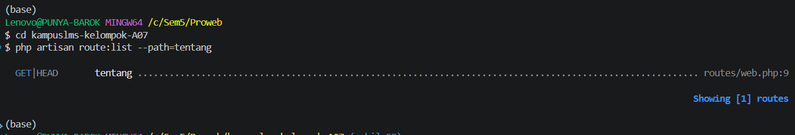

*READ*
1. Tidak ada yang menangkap /tentang karena route yang di web.php itu mengarah ke /halaman utama
2. tidak ada karna route /tentang belum dibuat
3. view yang dikembalikpaan adalah ```welcome``` di path ```resources/views/welcome.blade.php``` dan route /tentang belum ada
4. layout belum ada di routes, karna route langsung di kembalikan ke view ```welcome```  
5. Ya Cocok 

*BREAK*
|No | Yang dirusak | Prediksi Sebelum mencoba | Pesan error Sebenarnya|Yang DIpelajari
|---|--------------|-------------------|----------|-----------------|
1 |Ubah ``Route::get`` menjadi ``Route::post`` pada route daftar mata kuliah|Akan terjadi error saat mengakses halaman karena method salah|``Symfony\Component\HttpKernel\Exception\MethodNotAllowedHttpException`` (HTTP 405 Method Not Allowed)|Method HTTP tidak cocok → 405
2| Ubah nama view di ``return view(...)`` menjadi yang tidak ada|Halaman web gagal menampilkan view dan menampilkan pesan error | ``InvalidArgumentonException / View [nama-view] not found.`` | Exception view not found
3|Hapus ``->name('courses.show')``, lalu muat halaman yang memakai ``route('courses.show')``|Fungsi helper route akan bingung mencari nama route yang dimaksud|``Symfony\Component\Routing\Exception\RouteNotFoundException / Route [courses.show] not defined``.|Kenapa nama route wajib|
4|Pindahkan ``/courses/{course}`` ke ATAS ``/courses/create``, lalu buka ``/courses/create``|Symfony\Component\Routing\Exception\RouteNotFoundException / Route [``courses``.show] not defined.|``Illuminate\Database\Eloquent\ModelNotFoundException`` / Data dengan ID "create" tidak ditemukan| Urutan route menentukan|
5|Ganti ``{{ $nama }}`` menjadi ``{!! $nama !!}``, isi $nama dengan ``<script>alert('XSS')</script>``|Script JavaScript akan tereksekusi langsung sebagai pop-up alert di browser|Tidak ada error di Laravel, tetapi browser langsung mengeksekusi script (muncul pop-up alert)|XSS nyata di layar Anda sendiri
6|Hapus ``@vite(...)`` dari layout|Tampilan web/CSS/JS tidak akan terhubung atau berantakan|Halaman terbuka, tapi file aset (CSS/JS bawaan Vite) gagal dimuat atau styled-nya hilang (muncul error console Vite manifest not found jika di mode production)| Aset tidak termuat
7|Hentikan ``npm run dev`` lalu muat ulang halaman|Halaman tetap bisa diakses karena file sudah di-build, atau styling Vite mati jika dev server dimatikan|Jika menggunakan hot-reload dev server, halaman menjadi kehilangan koneksi Vite (``Vite manifest not found`` atau koneksi tersendat ke port 5173)|Beda dev server vs build
8|Panggil ``route('courses.show')`` tanpa mengirim parameter|Parameter wajib untuk URL dinamis tidak terpenuhi|``Illuminate\Routing\RoutingException / Missing required parameter for [Route: courses.show]``|Missing required parameter