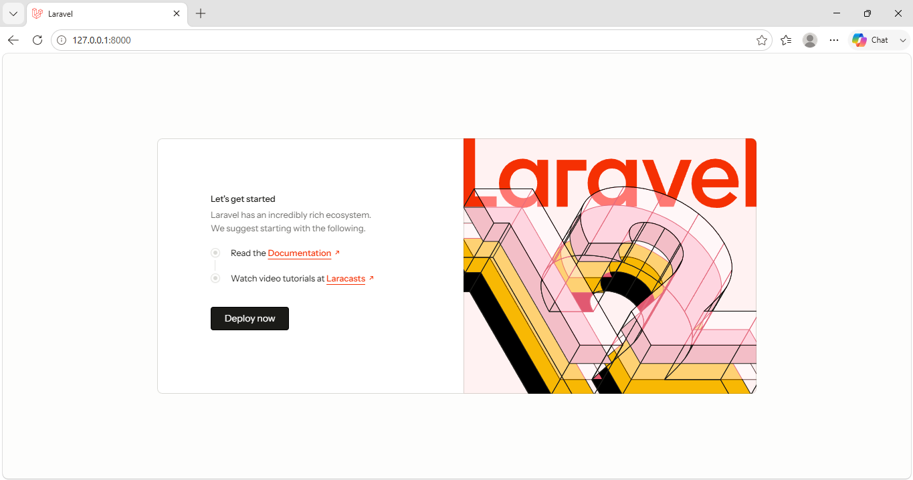

## READ 
1. Berkas public/index.php ini adalah pintu masuk utama aplikasi Laravel jadi saat pengguna mengakses website, berkas ini menyiapkan dahulu hal-hal yang dibutuhkan Laravel, seperti memeriksa apakah aplikasi sedang dalam mode perbaikan dan memuat komponen yang diperlukan. Jika semuanya sudah siap, berkas ini menangkap permintaan dari pengguna dan meneruskannya ke Laravel supaya bisa diproses dan menghasilkan halaman atau respons yang sesuai.

2. - Route: Bagian withRouting() mengatur route atau alamat halaman aplikasi, terutama yang mengarah ke routes/web.php.
   - Middleware: Bagian withMiddleware() digunakan untuk mengatur pemeriksaan terhadap request sebelum diproses.
   - Exception: Bagian withExceptions() digunakan untuk mengatur penanganan error atau masalah yang terjadi pada aplikasi.

3. Di routes/web.php terdapat route untuk menampilkan halaman utama dengan memanggil view welcome. Saya mengubah teks yang ada di halaman tersebut melalui file resources/views/welcome.blade.php. Setelah disimpan dan halaman browser di-refresh, teks yang tampil berubah sesuai dengan yang saya ubah.
Sebelum diubah: 
Setelah diubah: 

4. php artisan route:list untuk melihat semua alamat yang terdaftar di aplikasi Laravel. Setelah dicocokkan dengan routes/web.php, route / dan /tentang sesuai dengan dua route yang dibuat di file tersebut. Route storage/{path} dan up merupakan route yang disediakan oleh Laravel.

## BREAK 
| # | Yang dirusak | Prediksi sebelum mencoba | Pesan error sebenarnya |
|---|---|---|---|
| 1 | Ganti nama `.env` menjadi `.env.bak` | Kemungkinan website tidak bisa berjalan karena file pengaturannya hilang. | Muncul 500 SERVER ERROR pada halaman browser 127.0.0.1:8000. |
| 2 | Kosongkan `APP_KEY` | Kemungkinan akan muncul error karena ada pengaturan penting yang dikosongkan. | Muncul Internal Server Error (500) dengan pesan Illuminate\Encryption\MissingAppKeyException dan keterangan “No application encryption key has been specified.” |
| 3 | Ubah `DB_DATABASE` menjadi nama yang tidak ada | Kemungkinan website tidak bisa mengambil data karena database tersebut tidak ada. | Muncul Internal Server Error (500) dengan Illuminate\Database\QueryException. Pesan yang muncul adalah SQLSTATE[HY000] [1049] Unknown database 'lar', yang berarti database lar tidak ditemukan. |
| 4 | Ubah `APP_DEBUG=false`, lalu ulangi nomor 3 | Kemungkinan tetap error, tetapi pesan errornya tidak akan sedetail sebelumnya. | Muncul 500 SERVER ERROR pada halaman browser 127.0.0.1:8000. |

## CHECKPOINT
- [x] Alur request dari browser sampai HTML kembali.
- [x] Alasan hanya folder `public/` yang diekspos ke internet.
- [x] Perbedaan `.env` dan `.env.example`.
- [x] Pendaftaran middleware di Laravel 12 pada `bootstrap/app.php`.
- [x] Risiko `APP_DEBUG=true` di lingkungan production.