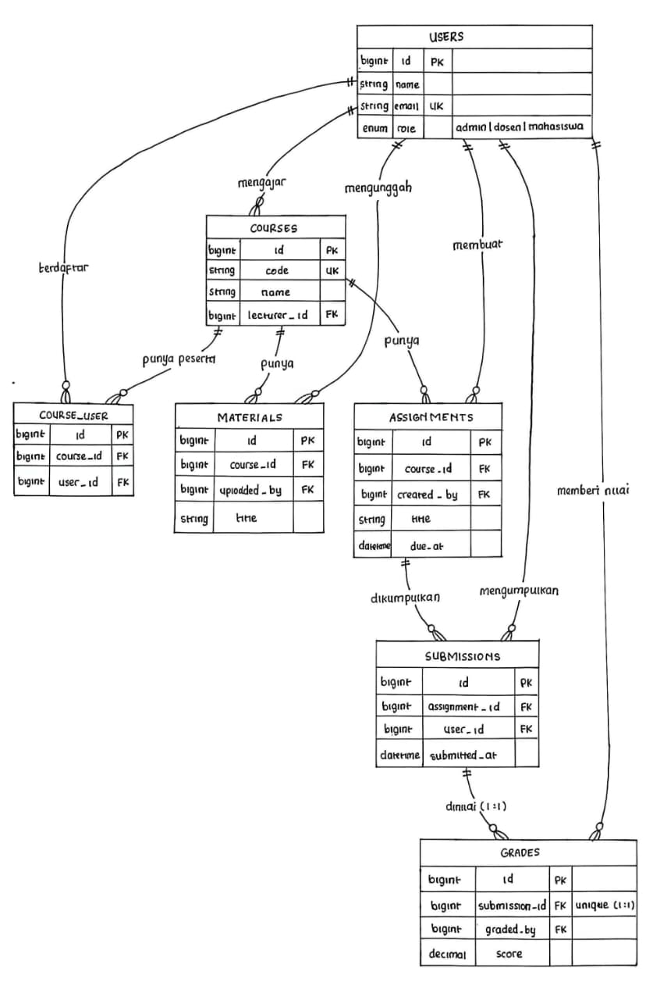

## READ
1. Gambar ulang ERD dari spesifikasi di papan/kertas, tanpa melihat dokumen.
   Jawab:
   

2. Untuk setiap foreign key, tentukan perilaku onDelete-nya dan tuliskan alasannya.
   Jawab: 

|Foreign key |``onDelete``|Alasan|
|------------|------------|------|
|``courses.lecturer_id``|``SET NULL``|mata kuliahnya tetap ada walaupun dosennya dihapus jadi kolomnya harus bisa bernilai ``NULL``|
|``assignments.course_id``|``CASCADE``|tugasnya bergantung sama mata kuliah jadi kalau mata kuliahnya dihapus tugasnya ikut dihapus|
|``submissions.assignment_id``|``CASCADE``|submission dibuat untuk tugas tertentu jadi kalau tugasnya dihapus submissionnya juga ikut dihapus|
|``submissions.student_id``|``RESTRICT``|data submission dan riwayat akademik sebaiknya tetap ada walaupun akun mahasiswa dihapus jadi lebih aman kalau akunnya dinonaktifkan atau pakai soft delete|
|``grades.submission_id``|``CASCADE``|nilai bergantung sama submission jadi kalau submission dihapus nilai yang terkait juga ikut dihapus|

3. kalau seorang dosen dihapus, apa yang terjadi pada mata kuliahnya? Kenapa dirancang begitu?
   Jawab: mata kuliahnya tetap ada tapi courses.lecturer_id diubah jadi NULL.
   alasannya karena dosen dan mata kuliah itu datanya beda jadi kalau dosennya dihapus bukan berarti mata kuliahnya juga harus ikut hilang tugas submission dan nilai juga tetap bisa disimpan, nantinya mata kuliah tersebut masih bisa diberikan ke dosen lain

4. kenapa grades.submission_id bersifat unique, bukan sekadar index biasa?
   Jawab: karena satu submission cuma boleh punya satu nilai, kalau cuma pakai index pencarian memang jadi lebih cepat tapi data yang sama masih bisa punya lebih dari satu nilai misalnya

submission_id | score
--------------|------
10            | 80
10            | 90

kalau pakai unique database bakal mencegah satu submission punya dua nilai
```php
$table->foreignId('submission_id')
    ->unique()
    ->constrained()
    ->cascadeOnDelete();
```
jadi hubungannya adalah one-to-zero-or-one artinya submission boleh belum punya nilai tapi kalau sudah dinilai cuma boleh punya satu data nilai