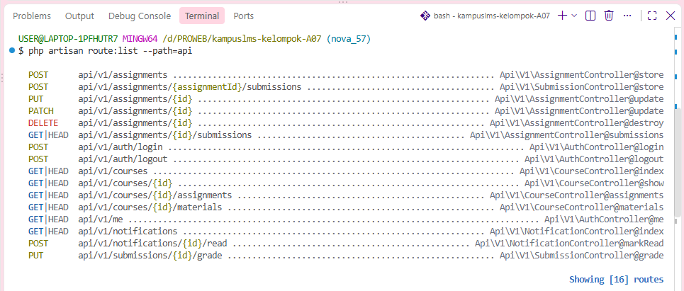

## READ
1. Jalankan php artisan install:api. Baca perubahan yang terjadi di bootstrap/app.php.
   Jawab: di `bootstrap/app.php` ditambahkan `api: __DIR__.'/../routes/api.php'`, jadi Laravel sekarang bisa membaca route API, selain itu install:api juga memasang sanctum dan membuat kebutuhan untuk autentikasi API menggunakan token

2. Buat satu endpoint GET /api/v1/courses sederhana.
   Jawab: saya membuat endpoint `GET /api/v1/courses` untuk mengambil data mata kuliah, routenya dibuat di `routes/api.php` dan hasilnya berupa JSON, bukan halaman HTML seperti di route web

3. Bandingkan dengan CourseController versi web yang sudah ada. Tulis di catatan: apa yang sama dan apa yang berbeda di antara keduanya?
   Jawab: 
   - Sama: sama sama digunakan untuk mengambil dan menampilkan data mata kuliah, keduanya juga menggunakan `CourseController` untuk mengatur prosesnya
   - Beda: kalau versi web hasilnya ditampilkan sebagai halaman HTML/Blade, sedangkan versi API hasilnya berupa JSON, routenya juga berbeda versi web ada di `routes/web.php`, sedangkan API ada di `routes/api.php`

4. Panggil endpoint API tanpa header Accept: application/json. Lalu dengan header itu. Catat bedanya.
   Jawab: kalau endpoint dipanggil tanpa `Accept: application/json`, response error dari Laravel bisa berupa HTML, sedangkan kalau ditambahkan header tersebut response akan diberikan dalam bentuk JSON, jadi header ini digunakan untuk memberi tahu laravel kalau kita mengharapkan response dalam bentuk JSON

5. Jalankan php artisan route:list --path=api. Cocokkan dengan kontrak di spesifikasi.
   Jawab: 
   saya menjalankan `php artisan route:list --path=api` lalu mencocokkannya dengan kontrak API di spesifikasi, dari hasilnya endpoint yang ada sudah sesuai dengan endpoint dan method yang diminta di kontrak, jadi dari sisi route API yang dibuat sudah lengkap. untuk bagian seperti autentikasi, role, scope, dan format response belum bisa dilihat hanya dari `route:list`

## BREAK
| No. | Yang dicoba                                               | Yang diamati                                                                               | Yang dipelajari                                                                                           |
| --- | --------------------------------------------------------- | ------------------------------------------------------------------------------------------ | --------------------------------------------------------------------------------------------------------- |
| 1   | Mengembalikan `User::all()` langsung                      | Data pengguna bisa ikut tampil, bahkan hash password bisa terlihat kalau `$hidden` dihapus | sebaiknya pakai API Resource supaya hanya data yang diperlukan yang keluar                                |
| 2   | Menghapus `auth:sanctum`                                  | Endpoint bisa diakses tanpa token                                                          | `auth:sanctum` penting untuk membatasi API yang hanya boleh diakses pengguna yang sudah login             |
| 3   | Memakai token yang sudah dihapus                          | Request ditolak dengan **401**                                                             | **401** berarti pengguna belum terautentikasi atau tokennya tidak valid                                   |
| 4   | Mahasiswa mencoba `POST /api/v1/assignments`              | Mendapat **403**                                                                           | **403** berarti sudah login tapi tidak punya izin untuk mengakses endpoint tersebut                       |
| 5   | Menghapus eager loading                                   | Query database bisa menjadi banyak atau terjadi N+1                                        | eager loading membantu supaya relasi tidak diambil satu-satu dan API tidak terlalu banyak melakukan query |
| 6   | Menghapus `throttle` dari login                           | Percobaan login bisa dilakukan berkali-kali tanpa batasan                                  | throttle diperlukan untuk mengurangi risiko brute force pada login                                        |
| 7   | Membuat pesan berbeda untuk email dan password yang salah | Orang bisa mengetahui email mana yang terdaftar                                            | pesan login sebaiknya dibuat sama supaya tidak membocorkan informasi akun pengguna                        |
