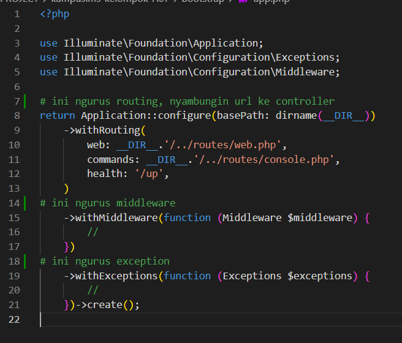
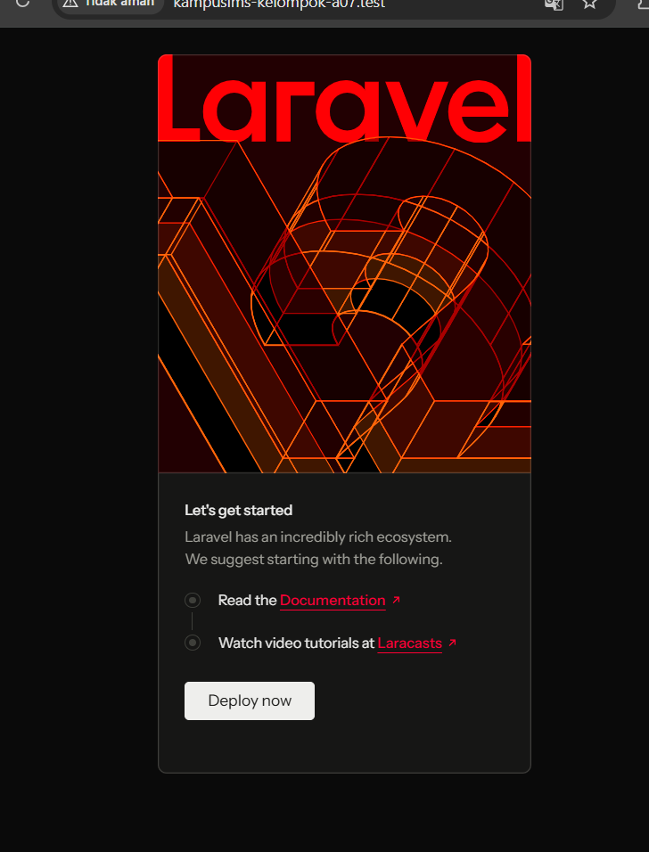
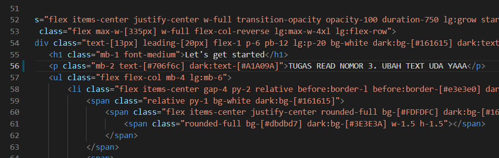
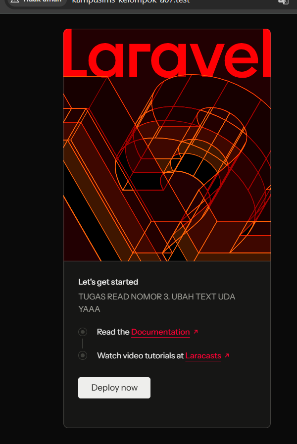
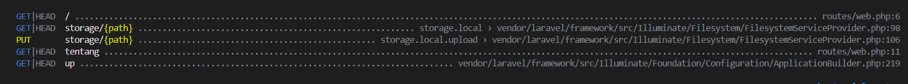

# Catatan Individu Minggu 01 - Patra Ananda (10241061)

## 1. Progres Pengerjaan
- Inisialisasi dan setup awal framework Laravel 12.
- Pengaturan Git repository dan branching kelompok.
- Mempelajari alur HTTP Request dan struktur direktori Laravel 12.
- Pembuatan dan pengujian route `/tentang` beserta tampilan profil kelompok.

---

## 2. Hasil Eksplorasi (Read - Break - Fix)

### READ

1. Buka public/index.php. Baca dari atas ke bawah. Tulis dalam 3 kalimat apa yang dilakukan berkas ini.
**public/index.php**: Berfungsi sebagai pintu masuk request browser ke aplikasi Laravel. Memuat autoloader dan mengeksekusi kejadian penanganan request.
2. Buka bootstrap/app.php. Identifikasi bagian mana yang mengurus route, mana yang mengurus middleware, mana yang mengurus exception.
**bootstrap/app.php**: Pusat konfigurasi di Laravel 12 untuk routing, middleware, dan exception.


3. Buka routes/web.php. Temukan route yang menghasilkan halaman selamat datang. Ubah teksnya, muat ulang browser, pastikan berubah.
**routes/web.php**: Definisi rute untuk aplikasi web Laravel, menentukan bagaimana URL dihubungkan ke controller.

    

    

    

4. berdasarkan hasil dari ```php artisan route:list``` suda cocok dengan isi routes/web.php. karna  hasilnya adalah 

    

    Diliat dari tabel ini untuk GET URL "/" itu ada pada routes/web.php:

    ```php
    Route::get('/', function () {
        return view('welcome');
    });
    ```
Dan juga untuk tentang juga seperti yang welcome. 
Untuk PUT `storage/{path}` dan GET `/up` itu bawaan dari laravel.

---

### BREAK

| # | Yang dirusak | Prediksi Anda sebelum mencoba | Pesan error sebenarnya |
|---|--------------|-------------------------------|------------------------|
| 1 | Ganti nama `.env` menjadi `.env.bak` |bakal error karna .env adalah format nya valid dan juga ketika ingin menjalankan laravel butuh app key kalau .env tidak di ketauhi bakal error |RuntimeException: No application encryption key has been specified. (Laravel tidak menemukan file konfigurasi env, sehingga APP_KEY dianggap kosong) |
| 2 | Kosongkan nilai `APP_KEY` di `.env` |error karna enkripsinya ga jalan | RuntimeException: No application encryption key has been specified. (Laravel wajib memiliki kunci enkripsi 32-karakter untuk mengamankan cookie & session) |
| 3 | Ubah `DB_DATABASE` menjadi nama yang tidak ada |websitenya tidak bisa akses database jadinya error kalau ada query yang dipanggil |SQLSTATE[HY000] [1049] Unknown database 'nama_db' Muncul halaman debug Ignition merah lengkap dengan rincian kode, query SQL, dan jejak path sistem |
| 4 | Ubah `APP_DEBUG=false`, lalu ulangi nomor 3 |kalau di ubah jadi true, ketika ada error pada websitenya struktur kesalahan bakal terlihat jelas salahnya dimana itu tidak boleh di ketauhi public |banyak struktur yang salah diliat oleh public dan juga error nya ga muncul karna sudah diubah jadi false | 


## 4. CHECKPOINT — Pertanyaan Mandiri
- [x] Alur request dari browser sampai HTML kembali.
- [x] Alasan hanya folder `public/` yang diekspos ke internet.
- [x] Perbedaan `.env` dan `.env.example`.
- [x] Pendaftaran middleware di Laravel 12 pada `bootstrap/app.php`.
- [x] Risiko `APP_DEBUG=true` di lingkungan production.
