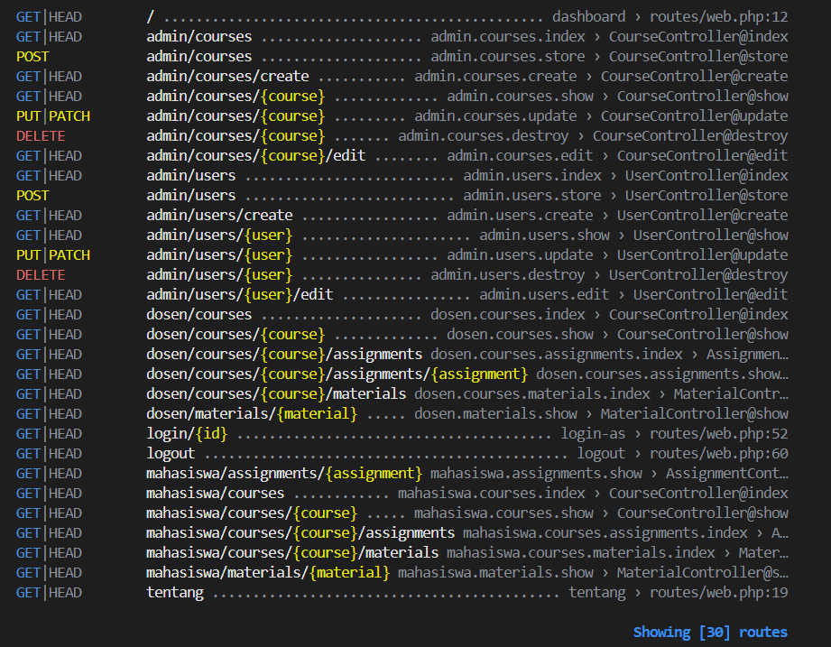

# Catatan Individu Minggu - 05 - Patra Ananda (10241061)

## 5.3 READ — BREAK — FIX — BUILD

### 1. READ — Peta Route Sendiri (30 menit)

#### Langkah 1: Jalankan `php artisan route:list --except-vendor`



#### Langkah 2: Tandai Setiap Route yang Menerima Parameter Model
Rute-rute yang menerima parameter model (`{course}`, `{user}`, `{assignment}`, `{material}`) ditandai dengan label [BERTANDA]:

1. `[BERTANDA]` `GET|HEAD admin/courses/{course}`
2. `[BERTANDA]` `PUT|PATCH admin/courses/{course}`
3. `[BERTANDA]` `DELETE admin/courses/{course}`
4. `[BERTANDA]` `GET|HEAD admin/courses/{course}/edit`
5. `[BERTANDA]` `GET|HEAD admin/users/{user}`
6. `[BERTANDA]` `PUT|PATCH admin/users/{user}`
7. `[BERTANDA]` `DELETE admin/users/{user}`
8. `[BERTANDA]` `GET|HEAD admin/users/{user}/edit`
9. `[BERTANDA]` `GET|HEAD dosen/courses/{course}`
10. `[BERTANDA]` `GET|HEAD dosen/courses/{course}/assignments` *(parameter `{course}`)*
11. `[BERTANDA]` `GET|HEAD dosen/courses/{course}/assignments/{assignment}` *(parameter `{course}` dan `{assignment}`)*
12. `[BERTANDA]` `GET|HEAD dosen/courses/{course}/materials` *(parameter `{course}`)*
13. `[BERTANDA]` `GET|HEAD dosen/materials/{material}`
14. `[BERTANDA]` `GET|HEAD mahasiswa/courses/{course}`
15. `[BERTANDA]` `GET|HEAD mahasiswa/courses/{course}/assignments` *(parameter `{course}`)*
16. `[BERTANDA]` `GET|HEAD mahasiswa/assignments/{assignment}`
17. `[BERTANDA]` `GET|HEAD mahasiswa/courses/{course}/materials` *(parameter `{course}`)*
18. `[BERTANDA]` `GET|HEAD mahasiswa/materials/{material}`
  
#### Langkah 3 & 4: Tabel "Daftar Titik Rawan IDOR"
Menjawab pertanyaan: **Siapa saja yang seharusnya boleh mengaksesnya, dan apa yang saat ini mencegah orang lain?**

Tabel inventarisasi titik rawan IDOR:

| Route Bertanda (Method & URI) | Parameter Model | Siapa Saja yang Seharusnya Boleh Mengaksesnya? | Apa yang Saat Ini Mencegah Orang Lain? |
|---|---|---|---|
| `GET /admin/courses/{course}` | `{course}` | Administrator sistem | Belum ada apa-apa (hanya route di bawah prefix `admin`, belum terpasang auth/role admin) |
| `PUT /admin/courses/{course}` | `{course}` | Administrator sistem | Belum ada apa-apa |
| `DELETE /admin/courses/{course}` | `{course}` | Administrator sistem | Belum ada apa-apa |
| `GET /admin/courses/{course}/edit` | `{course}` | Administrator sistem | Belum ada apa-apa |
| `GET /admin/users/{user}` | `{user}` | Administrator sistem & Pengguna pemilik akun itu sendiri | Belum ada apa-apa |
| `PUT /admin/users/{user}` | `{user}` | Administrator sistem & Pengguna pemilik akun itu sendiri | Belum ada apa-apa |
| `DELETE /admin/users/{user}` | `{user}` | Administrator sistem saja | Belum ada apa-apa |
| `GET /admin/users/{user}/edit` | `{user}` | Administrator sistem & Pengguna pemilik akun | Belum ada apa-apa |
| `GET /dosen/courses/{course}` | `{course}` | Dosen pengampu mata kuliah tersebut | Baru ada middleware `role:dosen` (dosen lain masih bisa intip jika tanpa `abort_unless`) |
| `GET /dosen/courses/{course}/assignments` | `{course}` | Dosen pengampu mata kuliah tersebut | Baru ada middleware `role:dosen` (belum ada filter dosen pengampu di query index) |
| `GET /dosen/courses/{course}/assignments/{assignment}` | `{course}`, `{assignment}` | Dosen pengampu mata kuliah tersebut | `Route::scopeBindings()` (mencegah salah induk) + pemeriksaan `abort_unless` manual di controller |
| `GET /dosen/courses/{course}/materials` | `{course}` | Dosen pengampu mata kuliah tersebut | Baru ada middleware `role:dosen` |
| `GET /dosen/materials/{material}` | `{material}` | Dosen pengampu mata kuliah pemilik materi | Belum ada apa-apa selain middleware `role:dosen` |
| `GET /mahasiswa/courses/{course}` | `{course}` | Mahasiswa yang secara sah mengambil kelas tersebut | Baru ada middleware `role:mahasiswa` (mahasiswa luar kelas masih bisa intip) |
| `GET /mahasiswa/courses/{course}/assignments` | `{course}` | Mahasiswa peserta kelas tersebut | Baru ada middleware `role:mahasiswa` |
| `GET /mahasiswa/assignments/{assignment}` | `{assignment}` | Mahasiswa peserta kelas tersebut | Baru ada middleware `role:mahasiswa` (rawan dibuka mahasiswa kelas lain) |
| `GET /mahasiswa/courses/{course}/materials` | `{course}` | Mahasiswa peserta kelas tersebut | Baru ada middleware `role:mahasiswa` |
| `GET /mahasiswa/materials/{material}` | `{material}` | Mahasiswa peserta kelas tersebut | Baru ada middleware `role:mahasiswa` |

---

### 2. BREAK — Enam Kerusakan

Pengujian kerusakan sesuai 6 butir pada modul praktikum:

| # | Yang Dicoba | Yang Diamati & Hasil Analisis |
|---|---|---|
| **1** | Login sebagai mahasiswa A, buka submission milik mahasiswa B dengan mengganti ID di URL browser. | **IDOR nyata:** File dan jawaban tugas mahasiswa B terbuka dan dapat dibaca. Terjadi karena controller hanya mengambil data via ID tanpa mengecek apakah `submission->user_id === auth()->id()`. |
| **2** | Buka nested route tanpa scoping: `/courses/1/assignments/99` (di mana tugas 99 milik mata kuliah lain). | **Lolos (200 OK):** Laravel hanya mengecek Course 1 ada dan Assignment 99 ada secara terpisah. Tugas mata kuliah lain nyasar masuk di bawah kelas Course 1 (salah induk). |
| **3** | Pasang pembungkus `Route::scopeBindings()` pada nested route, lalu ulangi nomor 2. | **Ditolak (404 Not Found):** Laravel mengubah query menjadi `$course->assignments()->findOrFail(99)`. Karena tugas 99 bukan anak dari Course 1, sistem melempar 404. |
| **4** | Mendaftarkan middleware di `app/Http/Kernel.php` seperti tutorial lama. | **Berkas tidak ada:** Pada Laravel 12, arsitektur `Kernel.php` sudah dihapus. Pendaftaran alias middleware dipusatkan di `bootstrap/app.php` di dalam `->withMiddleware()`. |
| **5** | Pasang middleware `role:admin` pada grup rute, lalu login dan akses menggunakan akun Dosen. | **403 Forbidden:** Middleware gerbang berhasil menghadang request dan melempar HTTP status 403 sebelum controller sempat dieksekusi. |
| **6** | Sebagai Dosen A, buka/edit mata kuliah milik Dosen B (keduanya sama-sama lolos `role:dosen`). | **Middleware saja tidak cukup:** Karena role keduanya sama-sama dosen, middleware meloloskannya. Data dosen B bisa diubah dosen A jika controller tidak memiliki pengecekan kepemilikan data (`course->lecturer_id === auth()->id()`). |

---

### 3. FIX — Perbaikan Repo Cacat (Branch `w05` pada `kampuslms-broken`)

Tujuh masalah yang diperbaiki pada branch `w05`:

1. **Route di luar grup `auth`:** Rute materi dan tugas terbuka untuk publik tanpa login ➔ Dipindahkan ke dalam grup `middleware('auth')`.
2. **IDOR pada Submission:** Mahasiswa dapat melihat berkas mahasiswa lain ➔ Ditambahkan validasi kepemilikan submission `abort_unless($submission->user_id === auth()->id() || auth()->user()->isLecturer(), 403)`.
3. **IDOR pada Material:** Materi draft/terbatas dapat diunduh langsung ➔ Ditambahkan verifikasi hak akses pada `download()`.
4. **Nested route tanpa `scopeBindings`:** URL `/courses/{course}/assignments/{assignment}` tidak memvalidasi relasi ➔ Dibungkus dengan `Route::scopeBindings()`.
5. **Middleware didaftarkan di berkas yang salah:** Registrasi masih memanggil `Kernel.php` ➔ Dipindahkan ke `bootstrap/app.php` menggunakan closure `->withMiddleware()`.
6. **Nama route bentrok antar peran:** Nama route `courses.index` tumpang tindih antara admin, dosen, dan mahasiswa ➔ Diberikan prefix nama (`admin.`, `dosen.`, `mahasiswa.`).
7. **Route destruktif memakai method `GET`:** Aksi hapus data memakai tautan GET ➔ Diubah menggunakan method `DELETE` berpelindung token `@csrf`.

#### Bukti cURL Perbaikan IDOR:
* **Sebelum Perbaikan (Bocor - 200 OK):**
  ```bash
  curl -X GET http://localhost:8000/submissions/2 --cookie "kampuslms_session=MAHASISWA_1_SESSION"
  # Respons: HTTP 200 OK (Data jawaban mahasiswa 2 terbuka untuk mahasiswa 1)
  ```
* **Setelah Perbaikan (Aman - 403 Forbidden):**
  ```bash
  curl -X GET http://localhost:8000/submissions/2 --cookie "kampuslms_session=MAHASISWA_1_SESSION"
  # Respons: HTTP 403 Forbidden (Akses ditolak karena bukan pemilik data)
  ```

---

### 4. BUILD — Struktur Route KampusLMS

Implementasi pada repositori `kampuslms-kelompok-A07`:

1. **Restrukturisasi `routes/web.php`:** Mengelompokkan rute berdasarkan peran (`admin`, `dosen`, `mahasiswa`) lengkap dengan prefix URL dan name prefix.
2. **Middleware `EnsureUserHasRole`:** Dibuat dan didaftarkan sebagai alias `'role'` di dalam `bootstrap/app.php`.
3. **Route Model Binding:** Diterapkan di seluruh controller (misal: `Course $course`, `Assignment $assignment`), menghilangkan query manual `findOrFail($id)`.
4. **Nested Resource & Scoped Bindings:** Rute bertingkat materi dan tugas dibungkus dengan `Route::scopeBindings()`.
5. **Pemeriksaan Kepemilikan Sementara:** Memasang `abort_unless` pada method `show`, `edit`, `update`, dan `destroy` untuk mencegah celah IDOR antar pengajar/mahasiswa.
6. **Halaman Error 403 Kustom:** Dibuatkan template di `resources/views/errors/403.blade.php` yang informatif dan ramah pengguna tanpa membocorkan privasi data.

---

## 5.4 Checkpoint Minggu 5

### 1. Apa itu IDOR? Peragakan satu contoh di aplikasi Anda, lalu tunjukkan perbaikannya.
* **Konsep:** **IDOR (*Insecure Direct Object Reference*)** adalah celah keamanan saat pengguna yang sah dapat mengakses atau memanipulasi data milik orang lain hanya dengan mengganti nomor ID pada URL browser.
* **Praktek di Aplikasi:**
  1. Login sebagai Dosen Hendy (ID: `4`) lewat: `http://localhost:8000/login/4`.
  2. Buka URL mata kuliah milik Bu Vika (Course ID: `2`) lewat: `http://localhost:8000/dosen/courses/2`.
  3. *Jika tanpa proteksi:* Halaman kelas Bu Vika terbuka lebar di layar Pak Hendy (bocor!).
* **Perbaikan di Controller:**
  Di `CourseController@show`:
  ```php
  abort_unless($course->lecturer_id === auth()->id(), 403);
  ```

### 2. Kenapa mengganti ID berurutan dengan UUID bukan perbaikan IDOR?
* Mengganti ID angka (`1, 2, 3`) menjadi UUID acak (`9b1deb4d-...`) hanya menerapkan *Security through Obscurity* (menyulitkan tebak-tebakan nomor urut), tetapi **tidak memberikan pengamanan hak akses**.
* Jika URL berformat UUID tersebut disalin atau bocor ke grup chat, siapa pun yang mengklik tautan tetap bisa membukanya karena server tidak memverifikasi apakah akun yang sedang login memiliki hak atas data tersebut.

### 3. Route model binding menjamin apa, dan tidak menjamin apa?
* **Menjamin:** **Keberadaan data di database (*Existence Check*)**. Laravel otomatis mengeksekusi `Course::findOrFail($id)`. Jika ID ada di tabel, objek diserahkan ke controller; jika tidak ada, langsung melempar `404 Not Found`.
* **Tidak Menjamin:** **Hak akses pengguna (*Authorization Check*)**. Route model binding tidak peduli siapa yang memanggil URL tersebut. Selama data ada di tabel, data akan diserahkan. Pengecekan otorisasi tetap wajib dibuat manual di controller atau Policy.

### 4. Apa yang dilakukan `Route::scopeBindings()`? Beri contoh URL yang lolos tanpa itu.
* **Fungsi:** Memastikan bahwa pada rute bertingkat (*nested route*), model anak yang dipanggil benar-benar memiliki relasi dengan model induknya (`$course->assignments()->findOrFail($assignmentId)`).
* **Contoh Kasus yang Lolos:**  
  URL: `/dosen/courses/1/assignments/4`  
  *(Course 1 adalah Pemrograman Web, sedangkan Tugas 4 milik Course 2 yaitu Kalkulus).*  
  * **Tanpa `scopeBindings()`:** Merespons **`200 OK`** (tugas mata kuliah lain nyasar masuk di bawah kelas Course 1).
  * **Dengan `scopeBindings()`:** Merespons **`404 Not Found`** (karena Tugas 4 bukan anak kandung dari Course 1).

### 5. Di berkas mana middleware didaftarkan pada Laravel 12? Kenapa berbeda dari kebanyakan tutorial?
* **Lokasi Pendaftaran:** Di berkas **`bootstrap/app.php`** di dalam closure `->withMiddleware()`:
  ```php
  ->withMiddleware(function (Middleware $middleware) {
      $middleware->alias([
          'role' => \App\Http\Middleware\EnsureUserHasRole::class,
      ]);
  })
  ```
* **Penyebab Perbedaan:** Pada Laravel 11 dan 12, berkas `app/Http/Kernel.php` telah ditiadakan agar struktur proyek lebih ramping (*lean*), sehingga registrasi middleware dipusatkan langsung di `bootstrap/app.php`.

### 6. Kenapa middleware `role:dosen` tidak cukup untuk mencegah dosen A mengedit mata kuliah dosen B?
* **Penyebab:** Middleware `role:dosen` hanya bekerja di gerbang rute luar (*Role-Based Access Control*). Tugasnya hanya memvalidasi apakah peran pengguna yang login adalah `dosen`.
* Karena Dosen A dan Dosen B keduanya berstatus dosen, keduanya lolos dari penjagaan middleware. Untuk mencegah Dosen A mengedit kelas Dosen B, wajib ada verifikasi kepemilikan objek (*Object-Level Authorization*) di tingkat controller:
  ```php
  abort_unless($course->lecturer_id === auth()->id(), 403);
  ```
